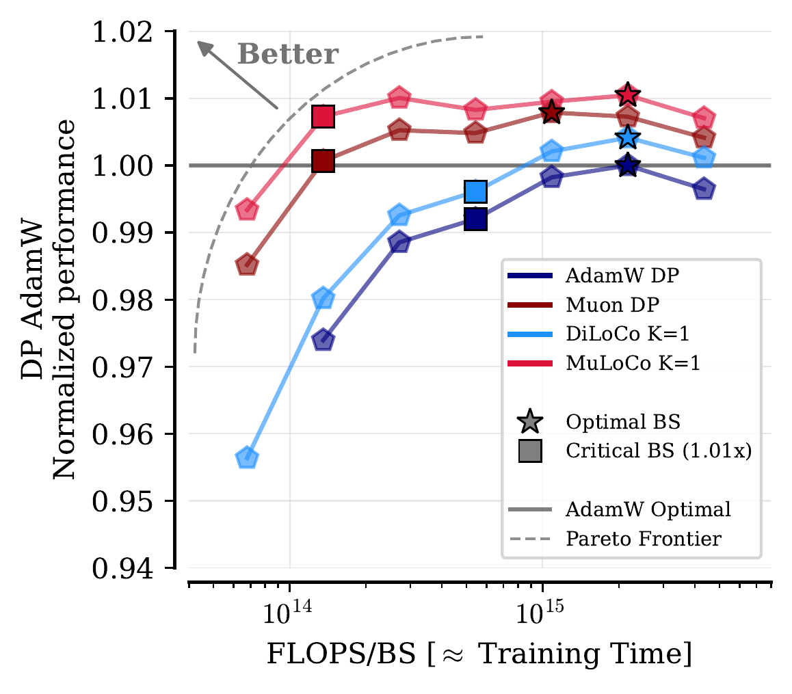
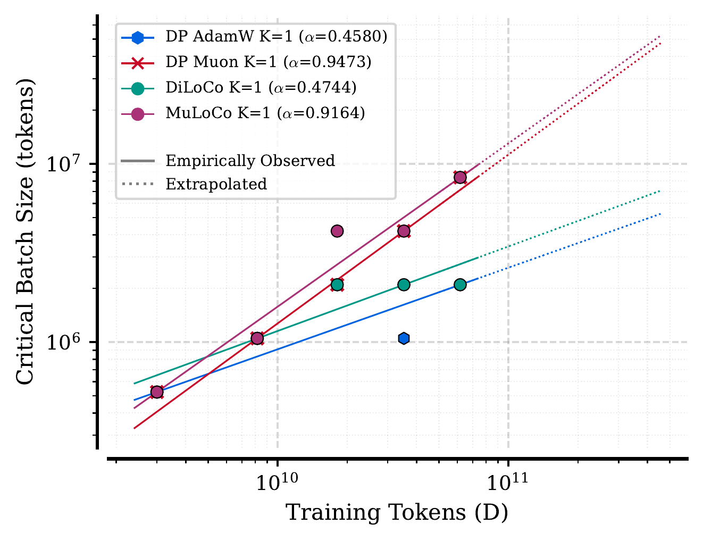
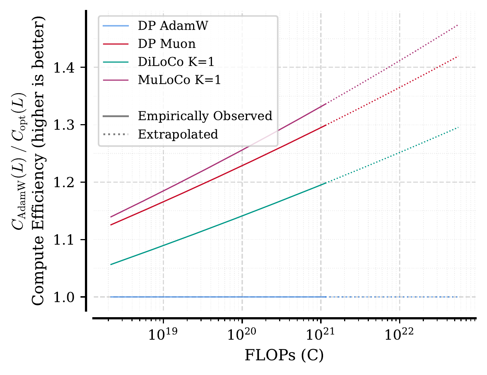
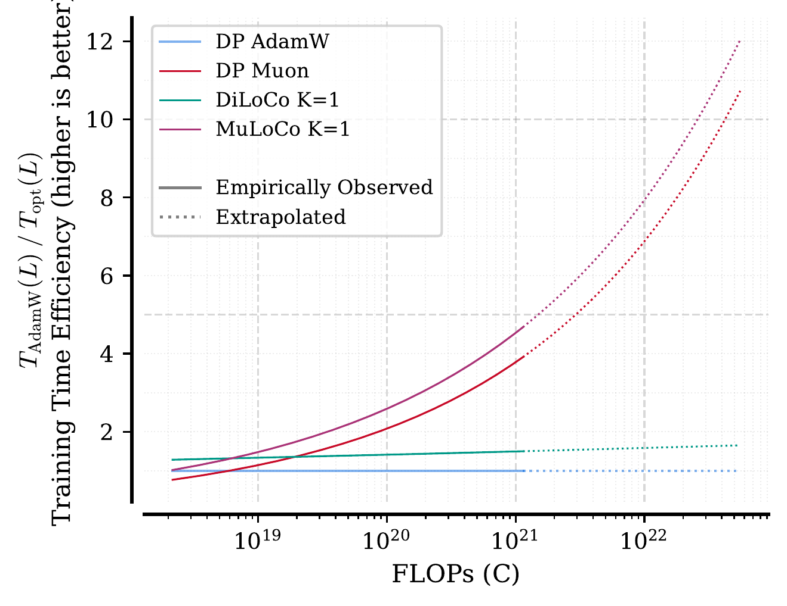

# MuLoCo-1

**The single-worker variant of MuLoCo that outperforms data-parallel Muon**



MuLoCo-1 is the K=1 (single-worker) variant of MuLoCo, the distributed optimizer from [*"MuLoCo: Muon is a Practical Inner Optimizer for DiLoCo"*](https://arxiv.org/abs/2505.23725). It uses a Muon inner optimizer and smooths the optimization trajectory with an SGD outer optimizer using Nesterov momentum. Despite its simplicity, MuLoCo-1 consistently outperforms data-parallel Muon across all tested scales while achieving a **Pareto-optimal performance–training time tradeoff**: it reaches better loss than all baselines while tolerating much larger batch sizes, enabling dramatically faster training when hardware parallelism is available. The implementations use the default hyperparameters from the paper, which were shown to perform well from 150M to 15B parameters.

> **Paper:** Benjamin Therien, Xiaolong Huang, Aaron Defazio, Irina Rish, Eugene Belilovsky.
> *"MuLoCo: Muon is a Practical Inner Optimizer for DiLoCo"*, 2025.
> [[arXiv]](https://arxiv.org/abs/2505.23725) [[Project Page]](https://bentherien.github.io/muloco-1/)

## Installation

```bash
# PyTorch
pip install "muloco[pytorch] @ git+https://github.com/bentherien/muloco-1.git"

# JAX/Optax
pip install "muloco[jax] @ git+https://github.com/bentherien/muloco-1.git"

# Both frameworks
pip install "muloco[pytorch,jax] @ git+https://github.com/bentherien/muloco-1.git"
```

For development:

```bash
git clone https://github.com/bentherien/muloco-1.git
cd muloco-1
pip install -e ".[pytorch,jax,dev]"
```

## Quick Start

### PyTorch

```python
from muloco.pytorch import MuLoCo1, Muon

# Classify parameters: Muon for 2D+ matrices, scalar optimizer for the rest
param_groups = [
    {"params": matrix_params, "algorithm": "muon"},
    {"params": other_params, "algorithm": "adamw"},
]

# MuLoCo-1: Muon inner + Nesterov SGD outer
optimizer = MuLoCo1(
    params=param_groups,
    inner_lr=0.02,
    outer_lr=0.7,
    outer_momentum=0.6,
    sync_interval=30,
)

# Standard training loop
for batch in dataloader:
    loss = model(batch).loss
    loss.backward()
    optimizer.step()
    optimizer.zero_grad()
```

### JAX/Optax

```python
from muloco.jax import muloco, diloco, muloco_wrapper

# MuLoCo with Muon inner optimizer
opt = muloco(
    learning_rate=0.02,
    outer_lr=0.7,
    outer_momentum=0.6,
    sync_interval=30,
)

# DiLoCo with AdamW inner optimizer
opt = diloco(
    learning_rate=1e-3,
    outer_lr=0.7,
    outer_momentum=0.9,
    sync_interval=30,
)

# Or wrap any optax optimizer
import optax
inner = optax.adamw(learning_rate=1e-3)
opt = muloco_wrapper(inner, outer_lr=0.7, sync_interval=30)

# Standard optax usage
opt_state = opt.init(params)
updates, opt_state = opt.update(grads, opt_state, params)
params = optax.apply_updates(params, updates)
```

## Algorithm

MuLoCo K=1 (Algorithm 1 from the paper):

```
For each sync round n = 1..N:
    1. Save snapshot:       theta_ref = theta
    2. Run H inner steps:   theta = InnerOpt(theta, grads)  x H
    3. Pseudogradient:      delta = theta_ref - theta
    4. Momentum update:     u = mu * u + eta_out * delta
    5. Nesterov step:       theta = theta_ref - mu * u - eta_out * delta
```

The inner optimizer runs for `H` steps (the `sync_interval`), then the outer Nesterov SGD corrects the trajectory using the accumulated parameter delta as a pseudogradient. In the multi-worker setting (K > 1), each worker runs this independently and pseudogradients are averaged across workers at each outer step.

## API Reference

### PyTorch (`muloco.pytorch`)

| Class | Description |
|-------|-------------|
| `MuLoCo1(params, inner_lr, outer_lr, outer_momentum, sync_interval, ...)` | Full MuLoCo-1 optimizer with Muon inner + Nesterov SGD outer |
| `Muon(params, lr, mu, ...)` | Standalone Muon optimizer (Newton-Schulz orthogonalization for 2D+ params, AdamW for others) |

### JAX/Optax (`muloco.jax`)

| Function | Description |
|----------|-------------|
| `muloco(learning_rate, outer_lr, outer_momentum, sync_interval, ...)` | MuLoCo with `optax.contrib.muon` inner optimizer |
| `diloco(learning_rate, outer_lr, outer_momentum, sync_interval, ...)` | DiLoCo with `optax.adamw` inner optimizer |
| `muloco_wrapper(inner_optimizer, outer_lr, outer_momentum, sync_interval)` | Generic wrapper: any optax optimizer + outer Nesterov SGD |
| `MuLoCoState` | NamedTuple holding optimizer state (inner_state, inner_count, param_snapshot, outer_momentum_buffer) |

## Example: Language Model Training

A complete training script is provided in `examples/train_lm.py`. It trains a GPT-style transformer (SwiGLU FFN, RMSNorm) on WikiText-103 or OpenWebText:

```bash
# Train with MuLoCo-1
python examples/train_lm.py --dataset wikitext --steps 5000

# Compare MuLoCo-1 vs vanilla Muon baseline
python examples/train_lm.py --dataset wikitext --steps 5000 --compare --compile

# SLURM cluster (Alliance Canada H100s)
sbatch examples/job.sh
```

### Results (4x H100, WikiText-103, 77.7M params, 5000 steps)

| Optimizer | Val Loss |
|-----------|----------|
| MuLoCo-1  | 2.6773   |
| Muon DP   | 2.6792   |

## Running Tests

```bash
# JAX tests
python tests/test_jax.py
python tests/test_jax.py --verbose
python tests/test_jax.py --quick
```

## Why MuLoCo-1? Scaling Analysis

### Critical Batch Size Grows Nearly Linearly with Scale

<p align="center"></p>

MuLoCo's critical batch size (the largest batch that doesn't hurt performance) scales nearly linearly with training tokens (exponent ~0.92), roughly **double** the rate of AdamW and DiLoCo (~0.46). This means MuLoCo can absorb far more data-parallel workers as models grow.

### MuLoCo Needs Less Compute to Reach the Same Loss

<p align="center"></p>

To reach any given loss target, MuLoCo requires ~1.3x fewer FLOPs than AdamW at the largest observed scale (3.1B), and this advantage grows with scale.

### Training Time Savings Are Even Larger

<p align="center"></p>

Combining fewer FLOPs with much larger batch sizes, MuLoCo reaches the same loss in ~5x fewer sequential steps than AdamW at 3.1B scale. This gap widens rapidly: extrapolation suggests >10x at 15B+ scale.

## Citation

```bibtex
@article{therien2025muloco,
    title={MuLoCo: Muon is a Practical Inner Optimizer for DiLoCo},
    author={Therien, Benjamin and Huang, Xiaolong and Defazio, Aaron and Rish, Irina and Belilovsky, Eugene},
    journal={arXiv preprint arXiv:2505.23725},
    year={2025}
}
```

## Acknowledgments

The Muon implementations used in MuLoCo are based on:
- **PyTorch**: [Dion](https://github.com/microsoft/dion) by Microsoft
- **JAX/Optax**: [optax.contrib.muon](https://github.com/google-deepmind/optax) by Google DeepMind

## License

MIT
